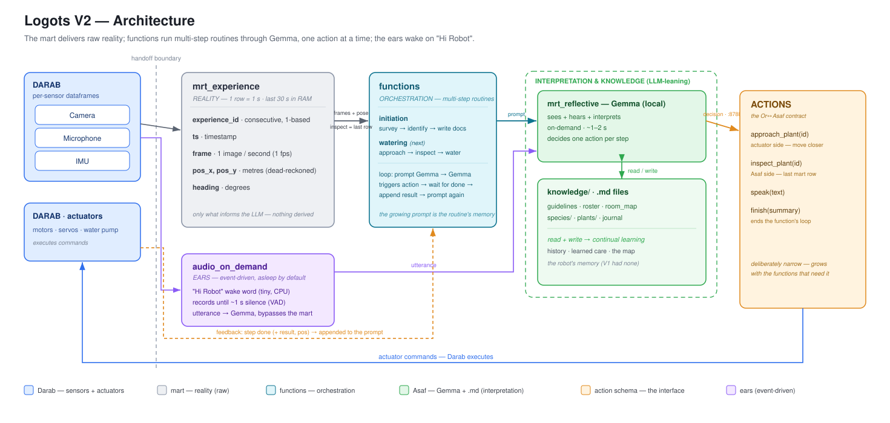

# Logots V2 — Architecture

*A proposal for Or (Darab). Author: Asaf.*

---

## 1. The question, and the answer

V2 has better hardware and a far stronger *local* model than V1. So the honest question: do we rebuild the architecture, or keep V1's?

**Answer — keep V1's two-tier skeleton (a fast perception layer + a slow reflective LLM), and change only two things:**

1. **the components** — one local Gemma replaces four models (YOLO + AST + Whisper + Claude Haiku);
2. **the data philosophy** — the pipeline delivers *raw reality*, and the LLM does the *interpreting*.

The shape was right the first time. V1 just built a lot of machinery to work around a blind LLM. V2 removes that machinery.

---

## 2. What V1 did

V1 was a medallion pipeline: `Sensory → Staging → Transformation → Mart → Decision → Execution`. Two decision tiers read the mart — a reactive rule layer (~3 s) and a reflective LLM (Claude Haiku, every 20 s over an 80-row window).

Crucially, **perception was pre-digested into features** — YOLO for cat detection, AST for audio class, Whisper for speech, IMU/motor math — because Haiku couldn't see or hear. It could only read numbers and text.

Three limits shaped V2:

- **Blind LLM** → an entire Transformation layer existed *only* to turn pixels and sound into features.
- **Cloud latency** → API round-trips plus a fixed 3 s chunk floor made responses slow (~6 s felt).
- **No memory** → each decision read 80 rows and forgot everything; the robot never learned.

---

## 3. The core reframe: reality vs. interpretation

This is the heart of V2. We split the system in two:

- **`mrt_experience` = reality.** Raw, time-aligned sensory truth — one row per second, keyed by `experience_id`. Its only job is to tell the LLM what is true *right now*. It holds nothing derived, and nothing that already lives in `.md`.
- **`.md` files + Gemma = interpretation & knowledge.** The `.md` files hold what we know *over time* (history, species care, the map, learned corrections). Gemma interprets the raw frame *in the moment* (reads a plant's health, points at a pot).

V1 blurred these — it computed interpretations (bounding boxes, audio classes) *inside* the pipeline and fed the LLM the conclusions. V2 keeps them apart: **the pipeline delivers reality; the model interprets it.**

In practice this "lean on the LLM" move comes down to one concrete change: **we send raw pictures to the reflective layer — not features** — and when someone speaks to the robot, the raw utterance audio goes straight to it too (§8).

---

## 4. The three deltas from V1

1. **Raw perception.** Gemma sees and hears, so YOLO + AST + Whisper + Haiku collapse into one local model and the Transformation feature-layer disappears.
2. **Persistent memory.** Per-plant `.md` files the LLM reads *and writes* give continual learning — e.g. *"this plant yellows on the generic schedule → stretch its interval."* V1 had none.
3. **Latency by routing.** Local model + event-triggered capture. Time-critical work never waits on the LLM; slow decisions (water / flag) tolerate its ~3 s median (measured on the Mac; heavy tail) because nobody is standing there waiting.

---

## 5. Choices we rejected (and why)

- **A multi-agent system** (a scan agent, a watering agent, …). At once-a-day cadence these are *tools*, not agents — one planner calling them is simpler and has fewer failure modes. We split a part off into its own agent only when it earns its own context, concurrency, or goal. None do yet.
- **Fully-live streaming perception.** V1 sliced sensors continuously to track a *moving cat*. A plant room is static and known: the robot perceives richly only when it acts, and leans on a stored map the rest of the time. We keep live perception exactly where embodiment needs it — crossing the room — and nowhere else.

---

## 6. The architecture

The flow (see diagram):

> Darab delivers one dataframe per sensor → we assemble **`mrt_experience`** (visual reality) → **Gemma** reads it plus the **`.md`** memory, decides and interprets → emits an **action** → Darab's **actuators** execute it.
>
> In parallel, **`audio_on_demand`** — the ears — sleeps until someone says *"Hi Robot"*, records the utterance, and hands it straight to Gemma (§8).

Gemma both reads and writes the `.md` files, which closes the learning loop.

The handoff boundary is unchanged: **Darab owns the sensors and actuators** (and the dataframes they produce); **we own everything in between** — the mart, the model, the memory, and the action logic.

---

## 7. `mrt_experience` — the reality contract

One row per **experience** — an experience spans one second. Rows are **consecutive and non-overlapping**: row *N*+1 begins exactly where row *N* ends, no shared frames, no gaps. The table lives in RAM — the last **30 rows ≈ 30 s** (~40 MB) — it is the present, not a stored history.

| field | what |
|---|---|
| `experience_id` | 1-based consecutive id — one per experience |
| `ts` | timestamp of the experience's representative instant |
| `frame` | one raw camera image for that second (**1 fps**) |
| `pos_x`, `pos_y` | body position in metres |
| `heading` | body heading in degrees |

Notes: pose is Darab's **dead-reckoning estimate** (integrated motor PWM + IMU yaw) — it drifts; an estimate, not ground truth. **Audio is not in the mart** — plants are silent, so continuously buffering sound bought nothing; speech reaches Gemma through `audio_on_demand` (§8). `touch_intensity` is deferred — a future transformation over the IMU stream, not a raw field.

The rule that keeps it clean: **it carries exactly the reality needed to execute the actions, and nothing else.** Anything derived (where's the pot), anything historical (when we last watered), and anything about a decision belongs to Gemma or `.md` — not here. That is why target-offsets, obstacle flags, and bounding boxes are out — those are interpretation, not reality.

---

## 8. `audio_on_demand` — the ears

The robot's hearing is **event-driven, not continuous**:

> sleep → *"Hi Robot"* wakes it → record while you speak → ~1 s of silence closes the capture → the utterance goes **straight to Gemma** (bypassing the mart) → Gemma answers with an action.

- The always-on part is a **tiny CPU wake-word model** — never Gemma (a ~3 s-per-call model can't be a continuous listener). Gemma wakes once per utterance.
- End-of-speech is silence detection (VAD); Gemma's 30 s audio ceiling bounds the utterance anyway.
- Gemma receives the **raw utterance audio** (no separate ASR stage — the reflection + ASR experiment already validated this) with output constrained to the action list. A request that maps to no action → `speak("I can't do that — I can only …")`.
- Replies start as **text**; routing them through the robot's speaker (TTS) is a later step on the actuator side.

**Unverified — needs testing:** wake-word detection quality, and whether a custom *"Hi Robot"* phrase needs a trained model (we can build the pipeline with a pretrained phrase and swap).

---

## 9. Action schema

The command list is the contract between Or's layer and ours. The robot can do exactly these, and each consumes a defined slice of reality:

| action | reality it consumes (from the mart) |
|---|---|
| `initiation` | `frame` + `pose` — classify a new/moved plant, record its spot |
| `scan_room` | `frame` + `pose` — build/refresh the plant map |
| `approach_plant(id)` | `pose` — target's spot comes from `.md` |
| `inspect_plant(id)` | `frame` |
| `capture_photo(subject)` | `frame` |
| `water_plant(id, ml)` | `frame` + `pose` (+ Gemma points at the pot) |
| `flag_issue(sev, …)` | `frame` |
| `speak(text)` | — (the utterance it answers arrived via `audio_on_demand`) |
| `daily_summary` | — (reads `.md` journal) |
| `return_to_base` | `pose` — base's spot comes from `.md` |
| `wait_until(next)` | — |

`initiation` is a *reconcile*, not a one-time step: it runs whenever a plant is added, moved, or removed. The daily report (`daily_summary`) is deterministic — it fires every cycle and Gemma only writes the prose; `flag_issue` is the LLM's own judgment call, carrying a severity that decides push-now vs. ride-along.

---

## 10. Interpretation, not data — the watering example

The clearest case of the split is watering. To aim, the robot needs the pot's position *in the frame*. In V1 that would be a bounding-box model — which was problematic. In V2 we **ask Gemma**: it is multimodal and can point at the pot on demand.

So the coordinate is **produced by the model when watering** — not precomputed by a detector, not stored in the mart. Because watering isn't time-critical, this can be a slow align step: *point → nudge → re-check → water.* No fast controller, no YOLO.

**Unverified — needs testing:** Gemma's pointing *accuracy* — whether it's precise enough to aim water — is unknown. This is a concrete experiment, exactly like the reflection + ASR tests we already ran.

---

## 11. Open decisions for Darab

- **Sensor set.** Confirmed today: camera, IMU, mic. Pose now ships in the staging layer as a **dead-reckoning estimate** (`pos_x/pos_y/heading` from PWM + IMU yaw) — it drifts, so true wheel **odometry** or visual localization remains open. Still-new requests:
  - **battery** level — informs `return_to_base`;
  - **ambient** light / temperature / humidity — informs care.
- **Watering hardware** — does the robot physically water, and with what tolerance? The whole premise rests on this.
- **Speaker output** — replies start as text; wiring TTS through the robot's amp so `speak()` is actually spoken.

---

*Companion to the V1 reference in [`archive/docs/logots_v1_guide.md`](../../archive/docs/logots_v1_guide.md). The Gemma reflection + ASR experiment that grounds the model choice lives in [`experiments/gemma_investigation/`](../../experiments/gemma_investigation/).*
